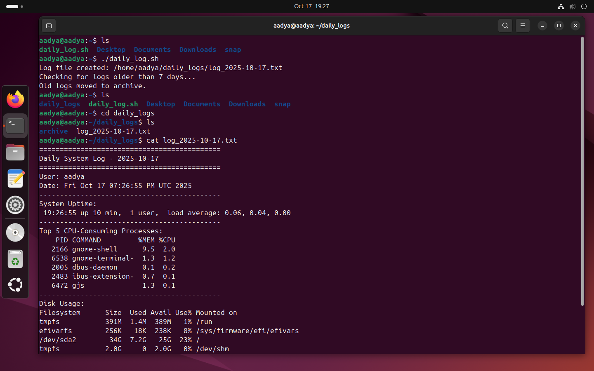
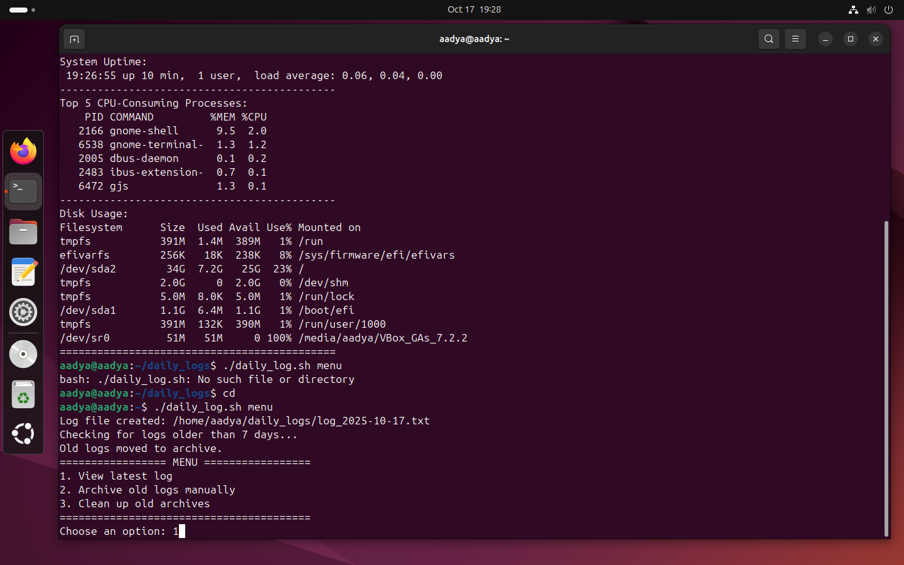
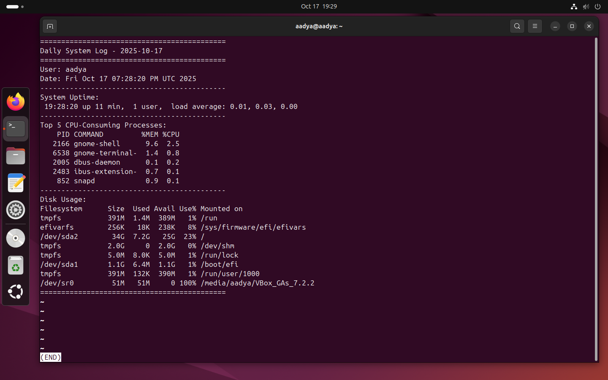
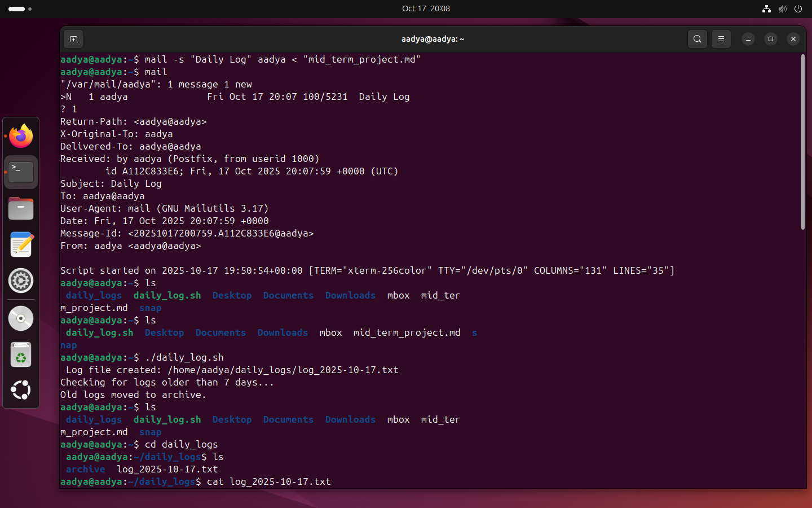

# Mid Term Project: Daily User Log Archiver

**Name:** Aadya Dubey  
**Roll No.:** 590029213  
***
***

## Aim

Create a shell script that logs current system information (user, date, running processes, disk usage), rotates logs, and schedules itself to run daily.

* * *

## Requirements:
* Any Linux Distro  
* Any text editor (VS Code, Vim,etc.)  
* Cron service for scheduling

***

## Script

### 1\. Save the following script as `daily_log.sh` in home directory:

```bash
#!/bin/bash

LOG_DIR="$HOME/daily_logs"
ARCHIVE_DIR="$LOG_DIR/archive"
TODAY=$(date +%Y-%m-%d)
LOG_FILE="$LOG_DIR/log_$TODAY.txt"
WEEKLY_ARCHIVE="$ARCHIVE_DIR/weeklylogs_$(date +%Y-%m-%d).tar.gz"

USER_NAME=$(whoami)

mkdir -p "$LOG_DIR"
mkdir -p "$ARCHIVE_DIR"

{
  echo "============================================"
  echo "Daily System Log - $TODAY"
  echo "============================================"
  echo "User: $USER_NAME"
  echo "Date: $(date)"
  echo "--------------------------------------------"
  echo "System Uptime:"
  uptime
  echo "--------------------------------------------"
  echo "Top 5 CPU-Consuming Processes:"
  ps -eo pid,comm,%mem,%cpu --sort=-%cpu | head -n 6
  echo "--------------------------------------------"
  echo "Disk Usage:"
  df -h
  echo "============================================"
} > "$LOG_FILE"

echo "Log file created: $LOG_FILE"

echo "Checking for logs older than 7 days..."
find "$LOG_DIR" -name "log_*.txt" -mtime +7 -exec mv {} "$ARCHIVE_DIR" \;
echo "Old logs moved to archive."

if ls "$ARCHIVE_DIR"/log_*.txt 1> /dev/null 2>&1; then
  tar -czf "$WEEKLY_ARCHIVE" -C "$ARCHIVE_DIR" log_*.txt
  rm "$ARCHIVE_DIR"/log_*.txt
  echo "Weekly archive created: $WEEKLY_ARCHIVE"
fi

if [ ! -d "$ARCHIVE_DIR" ]; then
  echo "Error: Archive directory missing!" >&2
fi

if [ "$1" == "menu" ]; then
  echo "================= MENU ================="
  echo "1. View latest log"
  echo "2. Archive old logs manually"
  echo "3. Clean up old archives"
  echo "========================================"
  read -p "Choose an option: " choice

  case $choice in
    1) less "$LOG_FILE" ;;
    2) tar -czf "$WEEKLY_ARCHIVE" -C "$ARCHIVE_DIR" log_*.txt ;;
    3) find "$ARCHIVE_DIR" -name "*.tar.gz" -mtime +30 -delete ;;
    *) echo "Invalid choice." ;;
  esac
fi
```

### 2\. Set up cron tab using `crontab -e` command and add:

```bash
0 20 * * * /home/yourusername/daily_log.sh
```

### Output Screenshots:




### 3\. Sending an email with the log as an attachment using `mail` command:

```bash
mail -s "Daily Log" username < "mid_term_project.md"
```

### Output Screenshots:

* * *

## Explanation

### 1\. Purpose

The script automatically:

- Records daily system information (user, uptime, top processes, disk usage)
- Saves it in a log file
- Moves old logs to an archive folder
- Compresses weekly logs into `.tar.gz` files
- Can be scheduled to run daily using a cron job

### 2\. Main Parts of the Script

#### Step 1: Configuration

At the beginning, the script sets up some variables:

```bash
LOG_DIR="$HOME/daily_logs"
ARCHIVE_DIR="$LOG_DIR/archive"
TODAY=$(date +%Y-%m-%d)
LOG_FILE="$LOG_DIR/log_$TODAY.txt"
WEEKLY_ARCHIVE="$ARCHIVE_DIR/weeklylogs_$(date +%Y-%m-%d).tar.gz"
USER_NAME=$(whoami)
```

- `LOG_DIR` → where all log files will be saved
- `ARCHIVE_DIR` → where old logs will be stored
- `TODAY` → current date (used for naming files)
- `LOG_FILE` → file name like `log_2025-10-18.txt`
- `USER_NAME` → current user who ran the script

#### Step 2: Make Folders

```bash
mkdir -p "$LOG_DIR"
mkdir -p "$ARCHIVE_DIR"
```

- Creates the folders if they don’t already exist.
- The `-p` flag prevents errors if the folder already exists.

#### Step 3: Create Daily Log

```bash
{
  echo "User: $USER_NAME"
  echo "Date: $(date)"
  uptime
  ps -eo pid,comm,%mem,%cpu --sort=-%cpu | head -n 6
  df -h
} > "$LOG_FILE"
```

This block:

- Logs the username and current date/time
- Shows system uptime
- Lists the top 5 CPU-consuming processes
- Displays disk usage
- Saves all of this information into the log file for that day

#### Step 4: Move Old Logs

```bash
find "$LOG_DIR" -name "log_*.txt" -mtime +7 -exec mv {} "$ARCHIVE_DIR" \;
```

- Finds all log files older than 7 days
- Moves them to the `archive` folder (this helps keep the main folder clean and organized).

#### Step 5: Create Weekly Archive

```bash
if ls "$ARCHIVE_DIR"/log_*.txt 1> /dev/null 2>&1; then
  tar -czf "$WEEKLY_ARCHIVE" -C "$ARCHIVE_DIR" log_*.txt
  rm "$ARCHIVE_DIR"/log_*.txt
fi
```

- Checks if there are any old logs in the archive folder
- Compresses them into one `.tar.gz file` (like a ZIP file)
- Deletes the individual log files after archiving

#### Step 6: Optional Features

The script also includes some optional features:

- Send the daily log via email (using the `mail` command)
- Check if the archive directory exists (error handling)
- Display a menu when run with the argument `menu` for manual actions Example:

```bash
./daily_log.sh menu
```

Then you can choose:

1.  View latest log
2.  Archive logs manually
3.  Clean up old archives

#### Step 7: Scheduling with Cron

At the end, there’s a note on how to schedule the script:

```bash
crontab -e
```

Then add:

```bash
0 20 * * * /home/username/daily_log.sh
```

This runs the script automatically every day at 8 PM.
***
***
